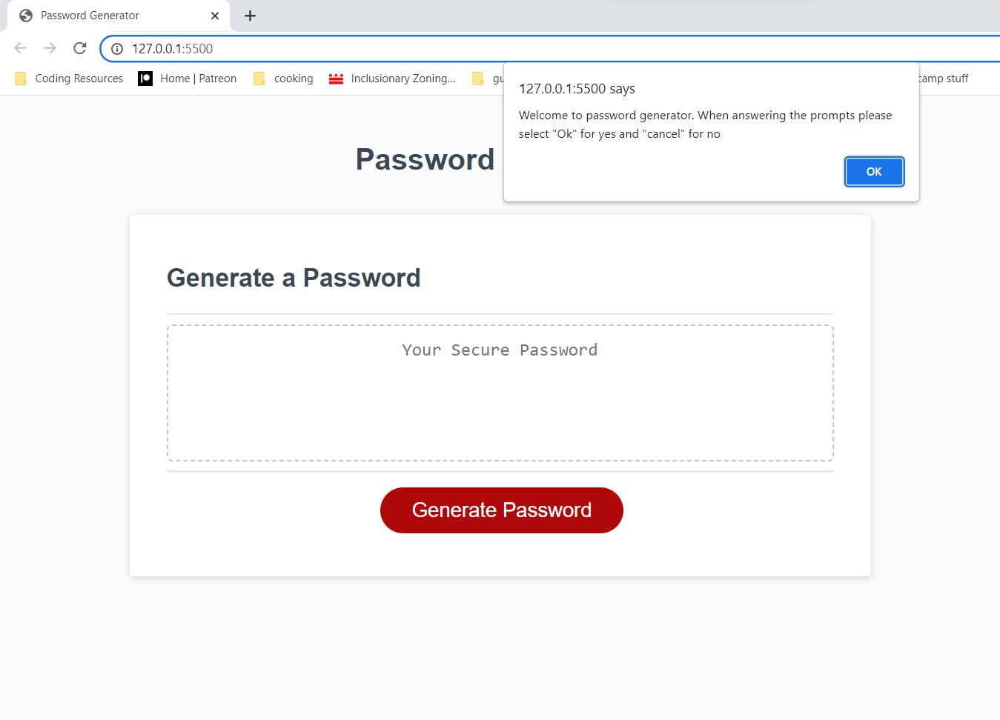
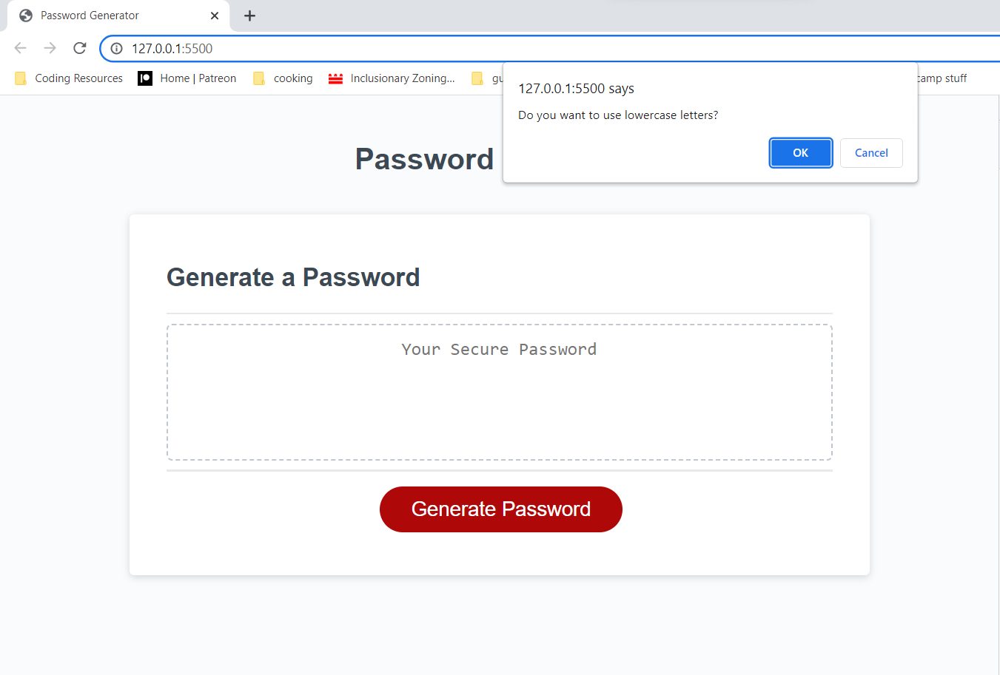

# Password Generator Starter Code

## Description

Provide a short description explaining the what, why, and how of your project. Use the following questions as a guide:

- This is a simple password generator designed to create a random password
- The password generated can be made using 1-4 character types (uppercase, lowercase, numbers, special characters)
- The user has the choice of choosing choosing which characters types are allowed in the password
- This was created to help improve the creators skillset in solving problems logically by building javascript code

## Table of Contents (Optional)

N/A

## Installation

N/A

## Usage

    -This is the default of what the website looks like. Once you click the button you will recieve a prompt with instructions

    -After selecting okay you will be prompted to choose which charcter types you want to use selecting okay (yes) or cancel (no) 

    -If none of the character prompts are selected the following alert will be sent along with the message "try again :)"

    If at least one of the character types is selected the following prompt will ask for users to give a numeral input from 8-128

    -If the input fits the criteria, a password will be generated like shown above (the generated password shows after you click ok. The one shown above was generated in a previous attempt)

    -If the the input doesn't fit the criteria because the number is too big or small a message "try again :)" will appear along with an alert explaining the number was out of bounds

    If the user placed anything outside of a number into the prompt then the message "try again :)" will appear along with an alert saying the input was invalid

## Credits

- Me, myself, I, and the starter code

## License

N/A

---

🏆 The previous sections are the bare minimum, and your project will ultimately determine the content of this document. You might also want to consider adding the following sections.

## Badges

Badges aren't necessary, but they demonstrate street cred. Badges let other developers know that you know what you're doing. Check out the badges hosted by [shields.io](https://shields.io/). You may not understand what they all represent now, but you will in time.

## Features

N/A

## How to Contribute

N/A

## Tests

N/A